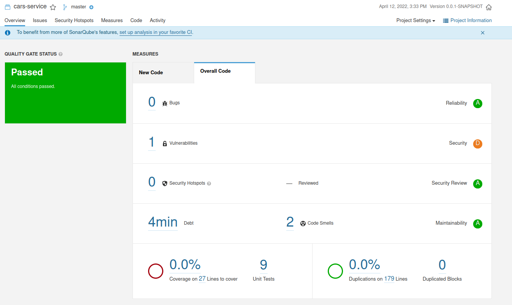
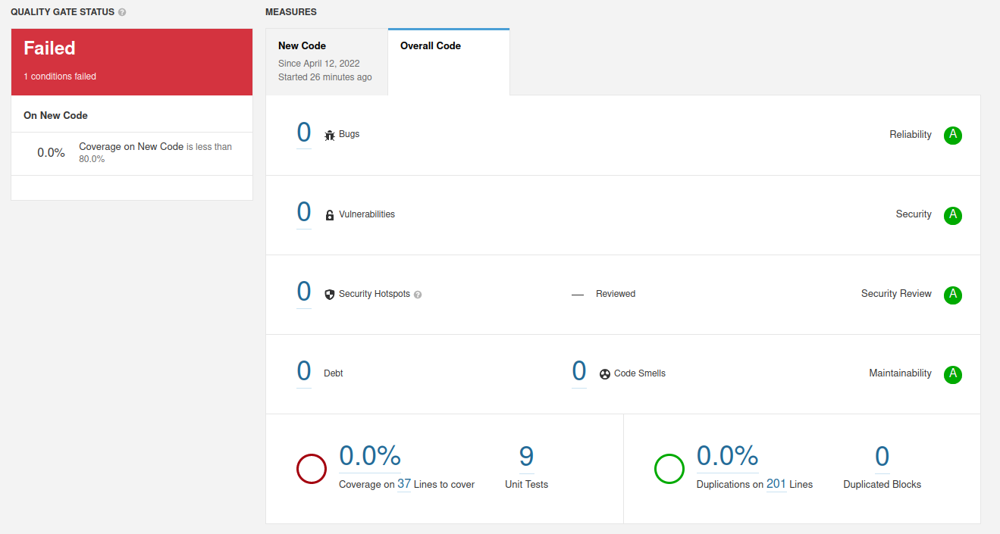
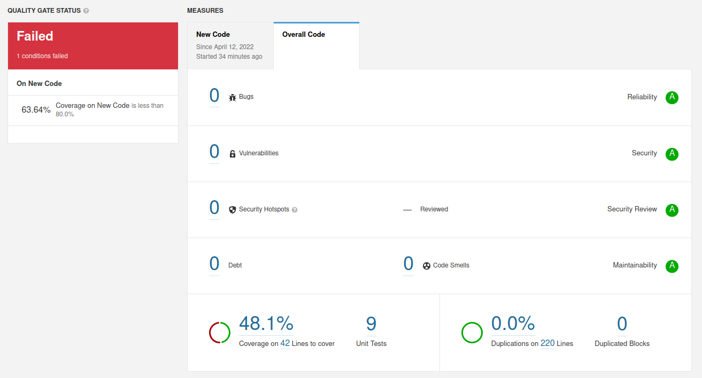

a) The analysis found a technical debt of 4 minutes, this value represents the amount of effort it will take to fix all code smells expressed in time.

The analysis detected one vulnerability and two code smells, one being of type minor and the other info.

b) The reported vulnerability is due to using the Entity data type as a parameter in the API methods.
The first code smell indicates to remove an unused import.
The second code smell indicates to remove a keyword public where is not needed.

c) There is a coverage of 48%, with 42 lines not covered and 12 conditions to cover.

